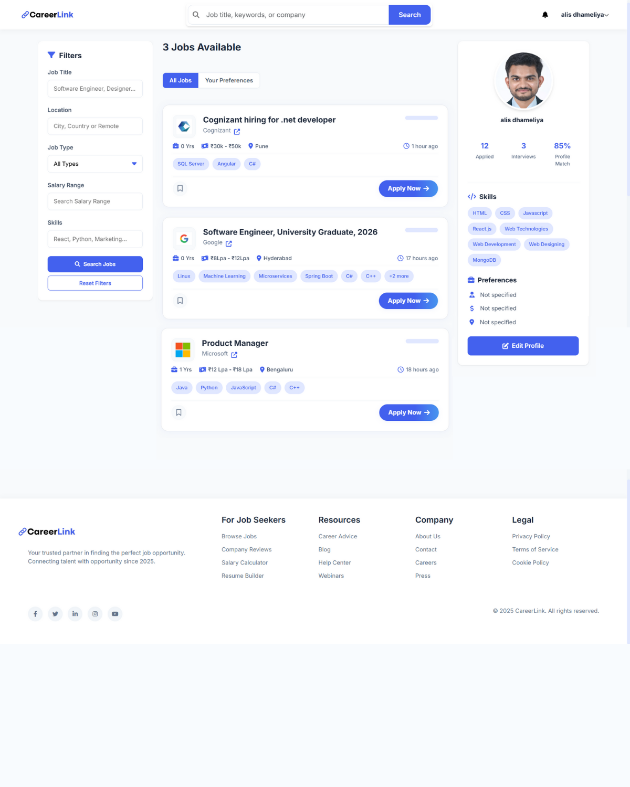

# Introduction

[visit this link to see full project](https://drive.google.com/file/d/1vhFeTGW3PVKQd7Hg4jdjBxt5gTsVTzWo/view?usp=drive_link)

Screenshots are provided at the End of readme. 

# How It Works

CareerLink is designed to streamline the job search process through the following workflow:

1. **User Registration & Profile Creation**

   - Users create accounts with basic information
   - Job seekers build comprehensive profiles with skills, experience, and portfolio
   - Employers create company profiles and job listings

2. **Job Search & Matching**

   - Advanced search functionality with filters (location, industry, salary)
   - AI-powered job matching based on user skills and preferences
   - Personalized job recommendations displayed on user dashboard

3. **Application Process**

   - One-click application submission
   - Resume and cover letter management
   - Application tracking system for both employers and job seekers

4. **Interview Management**

   - Scheduling system for interviews
   - Video interview capabilities
   - Feedback collection tools

5. **Career Development**

   - Skill assessment tools
   - Learning resources and course recommendations
   - Career path visualization

6. **Analytics & Reporting**
   - Job market insights and trends
   - Application success metrics
   - Employer hiring analytics

# Getting Started

TODO: Guide users through getting your code up and running on their own system. In this section you can talk about:

1. Installation process
2. Software dependencies
3. Latest releases
4. API references

# Build and Test

TODO: Describe and show how to build your code and run the tests.

# Contribute

TODO: Explain how other users and developers can contribute to make your code better.

If you want to learn more about creating good readme files then refer the following [guidelines](https://docs.microsoft.com/en-us/azure/devops/repos/git/create-a-readme?view=azure-devops). You can also seek inspiration from the below readme files:

- [ASP.NET Core](https://github.com/aspnet/Home)
- [Visual Studio Code](https://github.com/Microsoft/vscode)
- [Chakra Core](https://github.com/Microsoft/ChakraCore)

# Screenshots

Here are some screenshots of the application:

